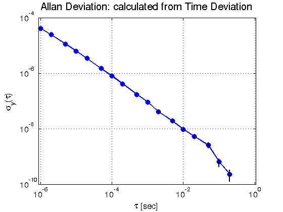
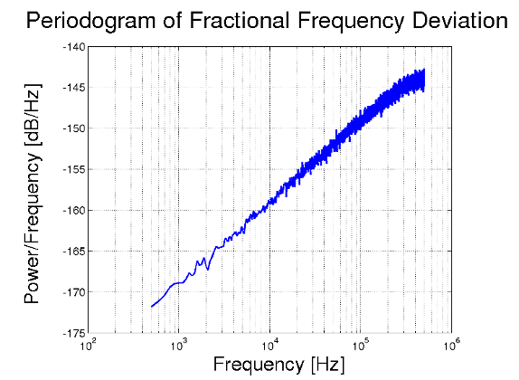

Command line utility for Powerlaw Noise (PLN) generation
===============================

Description
-------------------------------

This demo uses the libPLN library to implement a simple command line utility to generate Powerlaw Noise.
The generated powerlaw noise is saved as time deviation values into a file.

Usage
-------------------------------

See the Manual or call the demo binary with `--help` to get an overview over the available command line options.

Example
-------------------------------

Consider calling the program with the following parameters:

    $> ./PLN_Generator --alpha fpm --plnm kasdin-walter --kwl 10000

The resulting time deviation file will have flicker PM noise characteristics, as it is processed by a Kasdin/Walter filter with length 10000.
Most other options in this case depend on the default configuration: the result will be 1 million entries long, interpreted as 1MHz sample, with no interpolation and no high-pass filtering.

An analysis of the result can be seen in the following 3 graphs:

When plotted in the time domain, the high frequency noise contribution of FPM noise is visible.

Calculating the Allan Deviation shows a slope of -1/2 as is typical for FPM noise.

Plotting the power spectral density of the corresponding fractional frequency deviation shows the configured +1 slope for alpha.

Requirements
-------------------------------

This demo program uses Boost.Program_options and Boost.Lexical_Cast to parse the user input.
Thus, these libraries are needed to compile the demo.
See http://www.boost.org for details on how to obtain it on your platform.
